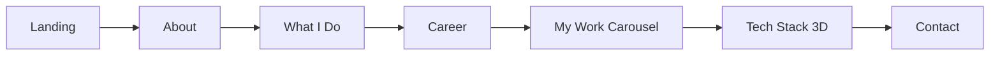
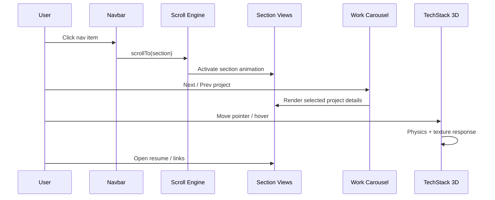

# Aryan Singhal - 3D Portfolio

A production-style personal portfolio built with React, TypeScript, Three.js, React Three Fiber, and GSAP.

This project highlights:
- A 3D interactive tech stack section
- Smooth scroll and transition effects
- App showcase carousel for iOS projects
- Focused sections for profile, experience, and contact

## Live Preview

- Local: `http://localhost:4173/`
- GitHub Pages (after deploy): `https://aryan2683.github.io/Aryan-Portfolio-3d/`

## Product Flow



## Dashboard-Like Interaction Sequence



## Core Sections

- **Landing**: Intro headline and role identity
- **About**: Short professional summary
- **What I Do**: Capability cards for iOS delivery and reliability focus
- **Career**: Timeline-based role and impact overview
- **My Work**: 3 featured iOS projects (LangTalk, SmartCash, SmartGen)
- **Tech Stack**: Interactive 3D scene with Swift/Firebase/iOS branding
- **Contact**: Direct links for LinkedIn and Email

## Tech Stack

- React 18
- TypeScript
- Vite
- Three.js
- @react-three/fiber
- @react-three/drei
- @react-three/rapier
- GSAP + ScrollTrigger/ScrollSmoother
- react-icons

## Run Locally

```bash
npm install
npm run dev -- --host 0.0.0.0 --port 4173
```

## Build

```bash
npm run build
npm run preview
```

## GitHub Pages Deployment

Deployment is automated through GitHub Actions using:
- `.github/workflows/deploy-pages.yml`

On push to `main`, the workflow:
1. Installs dependencies
2. Builds the app
3. Publishes `dist/` to GitHub Pages

## Project Structure

```text
.
├── public/
│   ├── images/
│   ├── models/
│   └── draco/
├── src/
│   ├── components/
│   │   ├── Character/
│   │   ├── styles/
│   │   └── *.tsx sections
│   ├── context/
│   ├── data/
│   └── main.tsx
├── .github/workflows/deploy-pages.yml
├── index.html
├── vite.config.ts
└── package.json
```

## Notes

- Optimized for desktop and responsive mobile layouts
- Heavy 3D bundles may show chunk-size warnings in production builds
- Current implementation prioritizes visual fidelity and interaction smoothness
